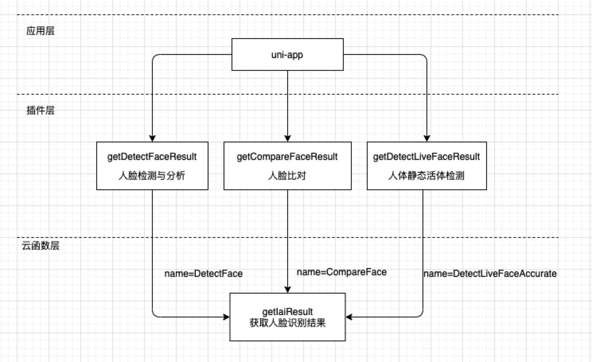

# 腾讯云人脸识别（IAI）插件

## 1. 插件介绍
| 标题      | 名称    |
| ----     | ---------------- |
| 中文名称   | 腾讯云人脸识别（IAI）插件 |
| 英文名称   | tencentcloud-plugin-iai |
| 最新版本   | v1.0.0 (2020.12.28) |
| 适用平台   | [DCloud uni-app](https://uniapp.dcloud.net.cn) |
| 适用产品   | [腾讯云神图·人脸识别](https://cloud.tencent.com/product/facerecognition) |
| GitHub项目| [tencentcloud-uniapp-plugin-iai](https://github.com/Tencent-Cloud-Plugins/tencentcloud-uniapp-plugin-iai) |
| gitee项目| [tencentcloud-uniapp-plugin-iai](https://gitee.com/Tencent-Cloud-Plugins/tencentcloud-uniapp-plugin-iai) |
| Demo项目   | [tencentcloud-uniapp-plugin-example](https://github.com/Tencent-Cloud-Plugins/tencentcloud-uniapp-plugin-example) |
| 主创团队   | 腾讯云中小企业产品中心（SMB Product Center of Tencent Cloud） |
| 兼容平台   | H5、小程序、APP |

一款帮助开发者在uni-app项目开发中快捷使用腾讯云神图·人脸识别产品功能的插件。

## 2. 功能特性

- 人脸检测与分析
- 人脸比对

## 3. 安装指引

本插件需要调用uniCloud云函数，而使用云函数的前提是：

- 使用DCloud官方开发工具HBuilderX 2.7+；
- 已注册DCloud开发者账号并通过实名认证；
- 开通了uniCloud并创建一个腾讯云的服务空间；

### 3.1. 新建或打开已有项目

1. 打开HBuilderX开发工具；
1. 新建或打开一个uni-app项目；

### 3.2. 导入云函数

1. 访问 DCloud 插件市场的 [腾讯云插件 - 云函数模板](https://ext.dcloud.net.cn/plugin?id=2139) 详情页；
2. 点击详情页右上角 **使用 HBuilderX 导入插件**，将云函数模板导入到您的项目中；

3. 在项目中打开 _cloudfunctions/tencentcloud-plugin/config.js_ 文件，将腾讯云的密钥信息配置进去，可以在腾讯云 [API 密钥管理](https://console.cloud.tencent.com/cam/capi) 中获取 SecretId、SecretKey 和 APPID；

4. 在[uniCloud控制台](https://unicloud.dcloud.net.cn/login)注册HBuild账号并登录，创建[云服务空间](https://uniapp.dcloud.net.cn/uniCloud/concepts/space)；

5. 在项目中打开 _cloudfunctions/tencentcloud-plugin/iai/config.js 文件，将region配置进去，具体可参考[地域列表](https://cloud.tencent.com/document/api/1073/37989#.E5.9C.B0.E5.9F.9F.E5.88.97.E8.A1.A8)；
6. 绑定云函数的云服务空间，将[云函数](https://uniapp.dcloud.net.cn/uniCloud/concepts/cloudfunction) [**上传部署**](https://uniapp.dcloud.net.cn/uniCloud/quickstart?id=rundebug) 到您的[云服务空间](https://uniapp.dcloud.net.cn/uniCloud/concepts/space)；


> 如果您之前在使用其它腾讯云产品的 uni-app 插件时已经导入过此云函数模板，则前 4 个步骤可以省略。

> 若导入失败或有其它疑问，请查看 [uniCloud帮助文档](https://uniapp.dcloud.io/uniCloud/README) 云函数相关章节。

### 3.3. 导入插件

1. 访问DCloud插件市场 [腾讯云人脸识别（IAI）插件](https://ext.dcloud.net.cn/plugin?id=3775) 详情页；
2. 点击详情页右上角 **使用HBuilderX导入插件** ，将插件导入到您的项目中；
3. 在项目中通过 import 语法将插件提供的方法导入到相关业务组件并使用；

> 本插件的默认导入位置是在您项目的“js_sdk”目录下

## 4. 使用指引

### 4.1. 插件API导图



### 4.2. 插件API列表

| API名称          | API对应方法名 |
| ---------------- | ------------- |
| 人脸检测与分析 | getDetectFaceResult |
| 人脸比对 | getCompareFaceResult |

### 4.3. 插件使用示例

```javascript
// 人脸识别-人脸检测与分析使用示例
// 从js_sdk列表中导入需要的api
import { getDetectFaceResult } from "@/js_sdk/tencentcloud-plugin-tmt";
import chooseImage2Base64 from '@/js_sdk/tencentcloud-plugin-iai/choose-image-2base64.js';

export default {
  data() {
    return {
      status: false,
      detectResult: ''
    };
  },
  methods: {
    // 开始识别
    async startDetect() {
      try {
        const img = await chooseImage2Base64();
        this.status = true;
        this.detectResult = '';
        uni.showLoading({
          mask: true
        });

        this.detectResult = await getDetectFaceResult({image: img});
      } catch (error) {
        uni.showToast({
          icon: 'none',
          title: error.message
        });
      } finally {
        this.status = false;
        uni.hideLoading();
      }
    }
  }
};
```

### 4.4 主要API 说明

#### getDetectFaceResult(params) ⇒ <code>Promise.&lt;object&gt;</code>
**Returns**: <code>Promise.&lt;object&gt;</code> - result 人脸检测与分析结果

| Param          | Type | Required |  Description |
| ---------------- | ------------- | ---- | ---- |
| params | <code>object</code> | <code>true</code> | 人脸检测与分析配置参数 |
| params.maxFaceNum | <code>integer</code> | <code>false</code> | 最多处理的人脸数目。默认值为1（仅检测图片中面积最大的那张人脸），最大值为120 |
| params.minFaceSize | <code>integer</code> | <code>false</code> | 人脸长和宽的最小尺寸，单位为像素。默认为34。建议不低于34。低于MinFaceSize值的人脸不会被检测 |
| params.image | <code>string</code> | <code>false</code> | 图片 base64 数据，base64 编码后大小不可超过5M。jpg格式长边像素不可超过4000，其他格式图片长边像素不可超2000。支持PNG、JPG、JPEG、BMP，不支持 GIF 图片 |
| params.url | <code>string</code> |  <code>false</code> | 对应图片 base64 编码后大小不可超过5M。jpg格式长边像素不可超过4000，其他格式图片长边像素不可超2000。url、image必须提供一个，如果都提供，只使用 url |
| params.needFaceAttributes | <code>integer</code> |  <code>false</code> | 是否需要返回人脸属性信息（FaceAttributesInfo）。0 为不需要返回，1 为需要返回。默认为 0 |
| params.needQualityDetection | <code>integer</code> |  <code>false</code> | 是否开启质量检测。0 为关闭，1 为开启。默认为 0。非 1 值均视为不进行质量检测 |
| params.faceModelVersion | <code>string</code> |  <code>false</code> | 人脸识别服务所用的算法模型版本 |
| params.needRotateDetection | <code>integer</code> |  <code>false</code> | 是否开启图片旋转识别支持。0为不开启，1为开启。默认为0 |

#### getCompareFaceResult(params) ⇒ <code>Promise.&lt;object&gt;</code>
**Returns**: <code>Promise.&lt;object&gt;</code> - result 人脸比对结果

| Param          | Type | Required |  Description |
| ---------------- | ------------- | ---- | ---- |
| params | <code>object</code> | <code>true</code> | 人脸比对配置参数 |
| params.imageA | <code>string</code> | <code>false</code> | A 图片 base64 数据，base64 编码后大小不可超过5M |
| params.imageB | <code>string</code> | <code>false</code> | B 图片 base64 数据，base64 编码后大小不可超过5M |
| params.urlA | <code>string</code> | <code>false</code> | A 图片的 url ，对应图片 base64 编码后大小不可超过5M，url、image必须提供一个，如果都提供，只使用 url |
| params.urlB | <code>string</code> |  <code>false</code> | B 图片的 url ，对应图片 base64 编码后大小不可超过5M，url、image必须提供一个，如果都提供，只使用 url |
| params.faceModelVersion | <code>string</code> |  <code>false</code> | 人脸识别服务所用的算法模型版本 |
| params.qualityControl | <code>integer</code> |  <code>false</code> | 图片质量控制。0: 不进行控制；1:较低的质量要求 2: 一般的质量要求 3: 较高的质量要求 4: 很高的质量要求 默认 0 |
| params.needRotateDetection | <code>integer</code> |  <code>false</code> | 是否开启图片旋转识别支持。0为不开启，1为开启。默认为0 |
### 4.5. 名词解释

服务空间：一个服务空间对应一整套独立的云开发资源，包括数据库、存储空间、云函数等资源。服务空间之间彼此隔离。更多详情请访问 [uniCloud开发文档](https://uniapp.dcloud.io/uniCloud/concepts/space)

云函数：云函数是运行在云端的JavaScript代码，更多详情请见 [uniCloud云函数文档](https://uniapp.dcloud.io/uniCloud/cf-functions)

## 5. 获取入口

| 插件入口       | 链接                                                                      |
| -------------- | ------------------------------------------------------------------------- |
| DCloud插件市场 | [腾讯云人脸识别（IAI）插件](https://ext.dcloud.net.cn/plugin?id=3775) |

## 6. FAQ
> 1. Q:有没有demo示例？
>    
>    A：请查看demo示例[tencentcloud-uniapp-plugin-example](https://github.com/Tencent-Cloud-Plugins/tencentcloud-uniapp-plugin-example)


## 7. GitHub版本迭代记录

### 7.1. tencentcloud-uniapp-plugin-tmt v1.0.0

- 人脸检测与分析
- 人脸比对
  
## 8. 联系我们

如果您是用户，欢迎加入我们的[官方交流社区](https://dnspod.chat/category/10)，反馈
- bug和故障，获取帮助。
- 新的插件功能需求。
- 新的开源应用插件适配需求。

如果您是开发者，欢迎参与我们[插件开源项目](https://github.com/Tencent-Cloud-Plugins)，和我们一起修复插件问题，为更多开源应用适配腾讯云插件。
